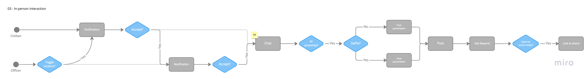

# Actors, Actions and Significant Scenarios

The following identifies the significant actors, actions and key scenarios that will inform the architecture of the Hey, Blue! application. The enumeration of important user stories is useful to gain a overall sense for what needs to be provided by the service. Each significant scenario also point to the related technical capabilities in the proposed architecture.

## Actors & Actions

The identified actors and their actions are as follows:

| Actor          | Actions |
| -------------- | ------- |
| Civilian       ||
| Police Officer ||
| Charity        ||
| Business       ||
| Administrator  ||

## Architecturally Significant Scenarios

The following are the most architecturally significant scenarios/flows, derived from the Actors and Actions above, which will shape the architecture of the Hey, Blue! system.

### Legend

This legend defines all the symbols that are used throughout our diagrams.

### Registration

#### ADR Links
- [01 - Limiting Storefront to Electronic Goods and Online Rebates](./adr/01-electronic-goods.md)
- [02 - Using QR Codes For Local Businesses](./adr/02-business-qr-codes.md)

### Virtual Handshake

#### ADR Links
- [04 - Including a Temporary Chat System for Interaction Coordination](./adr/04-chats.md)

### In-person Interaction

#### ADR Links
- [04 - Including a Temporary Chat System for Interaction Coordination](./adr/04-chats.md)

### Redeem Points

The TBD process off the `Yes` branch of the `Rewards?` decision is intentional, as for the first iteration of the Hey, Blue! platform, it will not fully integrate with an external business's rewards program. In addition to the technical complexity, there will need to be a partnership created between the two platforms. After the initial and successful launch of Hey, Blue!, the platform will have better leverage to entice these businesses to participate.

#### ADR Links
- [02 - Using QR Codes For Local Businesses](./adr/02-business-qr-codes.md)

### Events

This scenario is for step 7 of the police officer process, outlined in the [Hey, Blue! app requirements document](https://docs.google.com/document/d/10o-4eEzFo005pqDt_ORCztzaQCQ_9FNWYrxFasou3Eo).

### Location-less Interaction

#### ADR Links
- [06 - Using QR Codes for In-Person Interactions Without Location Tracking](./adr/06-interaction-no-location.md)

### Administrator

