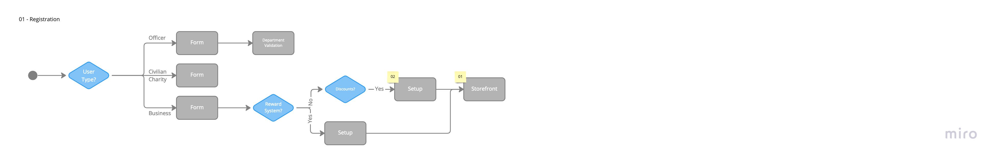
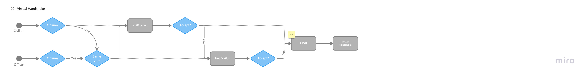

# Actors, Actions and Significant Scenarios

The following identifies the significant actors, actions and key scenarios that will inform the architecture of the Hey, Blue! application. The enumeration of important user stories is useful to gain a overall sense for what needs to be provided by the service. Each significant scenario also point to the related technical capabilities in the proposed architecture.

## Actors & Actions

The identified actors and their actions are as follows:

| Actor          | Actions |
| -------------- | ------- |
| Civilian       ||
| Police Officer ||
| Charity        ||
| Business       ||
| Administrator  ||

## Architecturally Significant Scenarios

The following are the most architecturally significant scenarios/flows, derived from the Actors and Actions above, which will shape the architecture of the Hey, Blue! system.

### Legend

This legend defines all the symbols that are used throughout our diagrams.

### Registration

#### ADR Links
- [01 - Electronics goods only](./adr/01-electronic-goods.md)
- [02 - QR codes for non-connected local businesses](./adr/02-business-qr-codes.md)

### Virtual Handshake

#### ADR Links
- [04 - Temporary chat for coordination](./adr/04-chats.md)

### Interaction

#### ADR Links
- [04 - Temporary chat for coordination](./adr/04-chats.md)

### Redeem Points

#### ADR Links
- [02 - QR codes for non-connected local businesses](./adr/02-business-qr-codes.md)

### Events

### Location-less Interaction

#### ADR Links
- [06 - In-person interaction without location](./adr/06-interaction-no-location.md)

### Administrator

