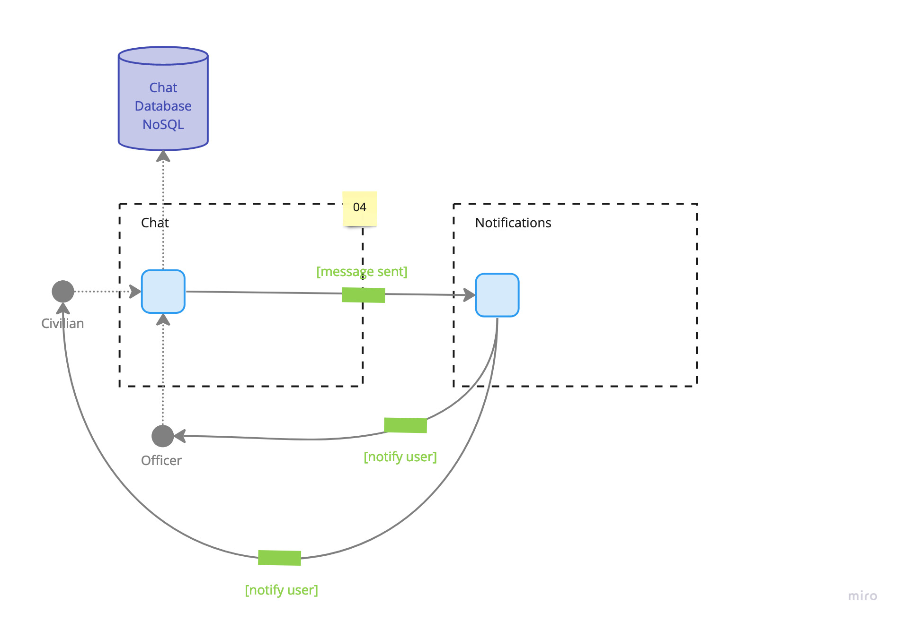

# Chats

## Diagram

## Description
The chat event processor provides a temporary space for a civilian and a police officer to coordinate the logistics for their in-person interaction. In addition, it provides an opportunity to make the virtual handshakes more meaningful by being social and exchanging a few words.

## Architectural Characteristics
- Availability
- Responsiveness
- Scalability
- Concurrency
- Workflow

## ADR Links
- [04 - Including a Temporary Chat System for Interaction Coordination](../adr/04-chats.md)
- [07 - Using an Event-Driven Architecture](../adr/07-event-driven.md)
- [08 - Using the Mediator Topology for our Event-Driven Architecture Solution](../adr/08-mediator-topology.md)