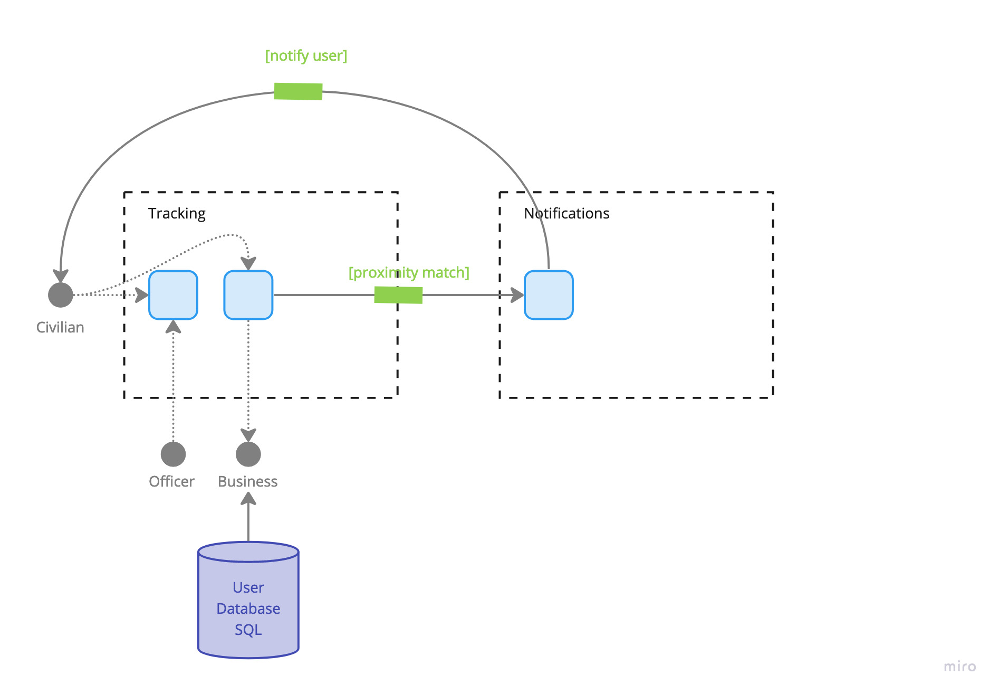

# Geolocation Tracking

## Diagram

## Description
The geolocation tracking event processor drives not only the virtual interactions between a user and a police officer, but the in-person interactions as well. It provides users with real time notifications about opportunities to connect and discover participating local businesses to redeem their points.

## Architectural Characteristics
- Availability
- Responsiveness
- Scalability
- Concurrency

## ADR Links
- [07 - Using an Event-Driven Architecture](../adr/07-event-driven.md)
- [08 - Using the Mediator Topology for our Event-Driven Architecture Solution](../adr/08-mediator-topology.md)