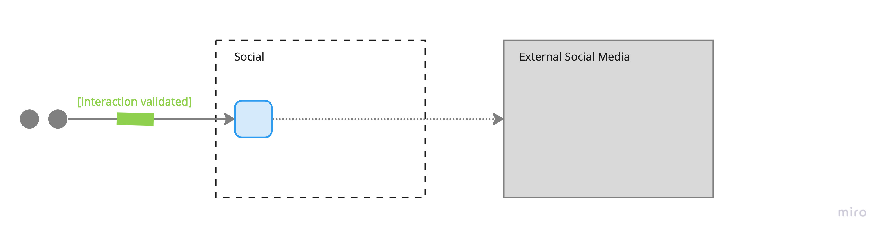

# Social Media

## Diagram

## Description
The social media event processor is in charge of posting the interaction (and its metadata) between a civilian and a police officer, once the proximity of the two users has been validated.

## Architectural Characteristics
- Interoperability
- Workflow
- Responsiveness

## ADR Links
- [07 - Using an Event-Driven Architecture](../adr/07-event-driven.md)
- [08 - Using the Mediator Topology for our Event-Driven Architecture Solution](../adr/08-mediator-topology.md)