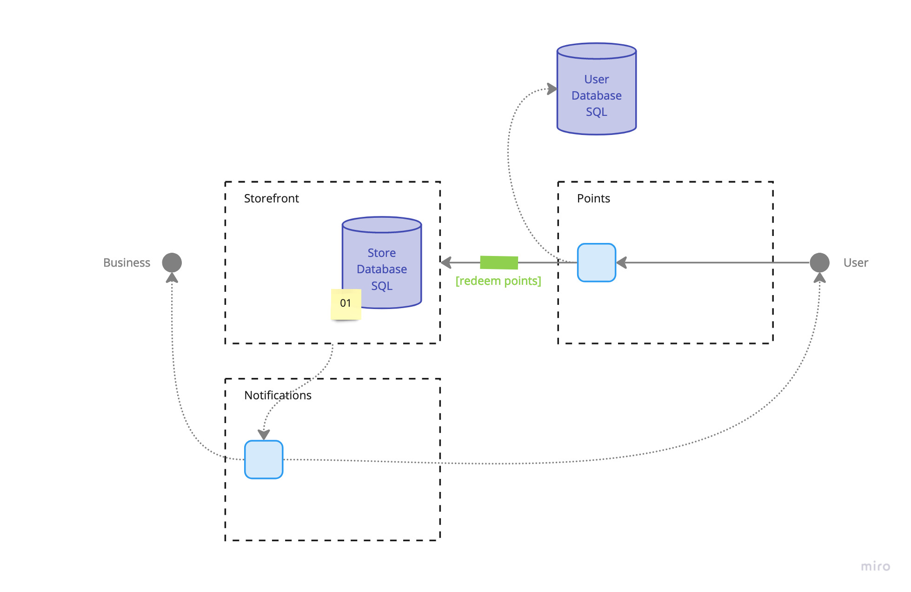

# Storefronts

## Diagram

## Description
The storefront event processor handles interactions between civilians and charities, and the listings from the external businesses. It also provides users with an opportunity to find retail establishments where they can redeem their points:

- with details listed on the storefront about the business
- with geolocation tracking and notifying the user about being close to a participating retail establishment

Refer to [ADR 01](../adr/01-electronic-goods.md) for the initial restrictions on the type of items being setup in the storefronts.

## Architectural Characteristics
- Interoperability
- Data Integrity
- Availability
- Responsiveness
- Concurrency

## ADR Links
- [01 - Limiting Storefront to Electronic Goods and Online Rebates](../adr/01-electronic-goods.md)
- [07 - Using an Event-Driven Architecture](../adr/07-event-driven.md)
- [08 - Using the Mediator Topology for our Event-Driven Architecture Solution](../adr/08-mediator-topology.md)