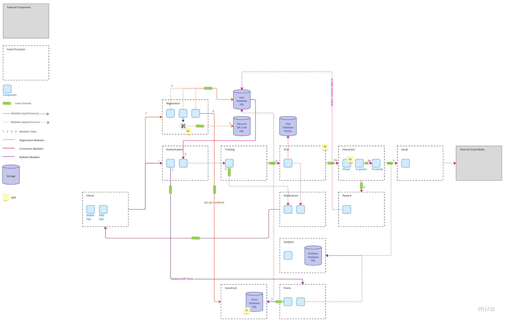

# High Level Architecture

The high-level architecture brings together the [architecture analysis](./architecture_analysis.md) and the [significant scenarios](./actors_actions_scenarios.md). The diagram shows the mediators (color coded, with their respective step numbers) and the workflows they direct, and how the different event processors interact with one another to provide the needed functionality for the Hey, Blue! platform.

### ADR Links
- [01 - Limiting Storefront to Electronic Goods and Online Rebates](./adr/01-electronic-goods.md)
- [02 - Using QR Codes For Local Businesses](./adr/02-business-qr-codes.md)
- [03 - Limiting Interactions to Virtual Handshakes When No Geolocation Tracking](./adr/03-virtual-no-location.md)
- [04 - Including a Temporary Chat System for Interaction Coordination](./adr/04-chats.md)